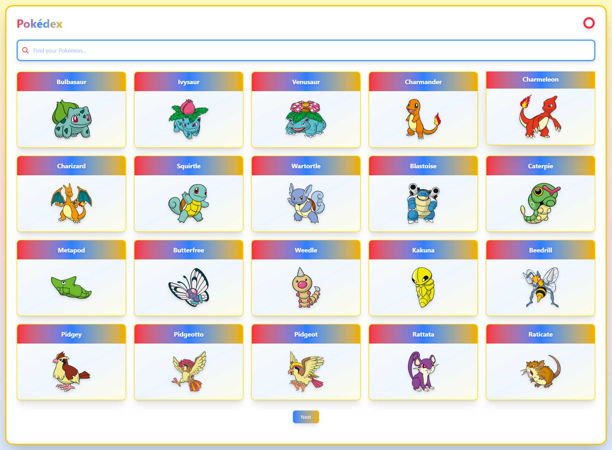
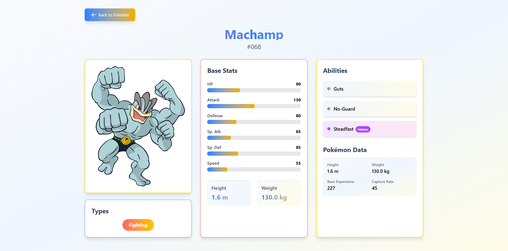

# Pokédex Website

## A modern Pokédex application built with React and TypeScript that allows users to browse and explore Pokémon with beautiful visuals and detailed information.

## 🌐 Live Demo

Try it here: [Pokédex Live Demo](#)

---

## 📸 Preview

### Home Page

   

### Pokémon Details Page

   

---

## 🚀 Features

- **Pokémon Listing**

  - Paginated display of Pokémon
  - Responsive grid layout
  - Loading states and error handling
  - Next/Previous navigation

- **Detailed Pokémon View**
  - Complete stat visualization
  - Type information with colored badges
  - Ability listing (including hidden abilities)
  - Physical characteristics (height/weight)
  - Animated sprites

## 🛠 Tech Stack

**Frontend:**

- React 18
- TypeScript
- Tailwind CSS
- Axios (API requests)
- React Router (Navigation)

**API:**

- [PokéAPI](https://pokeapi.co/) (REST API)
