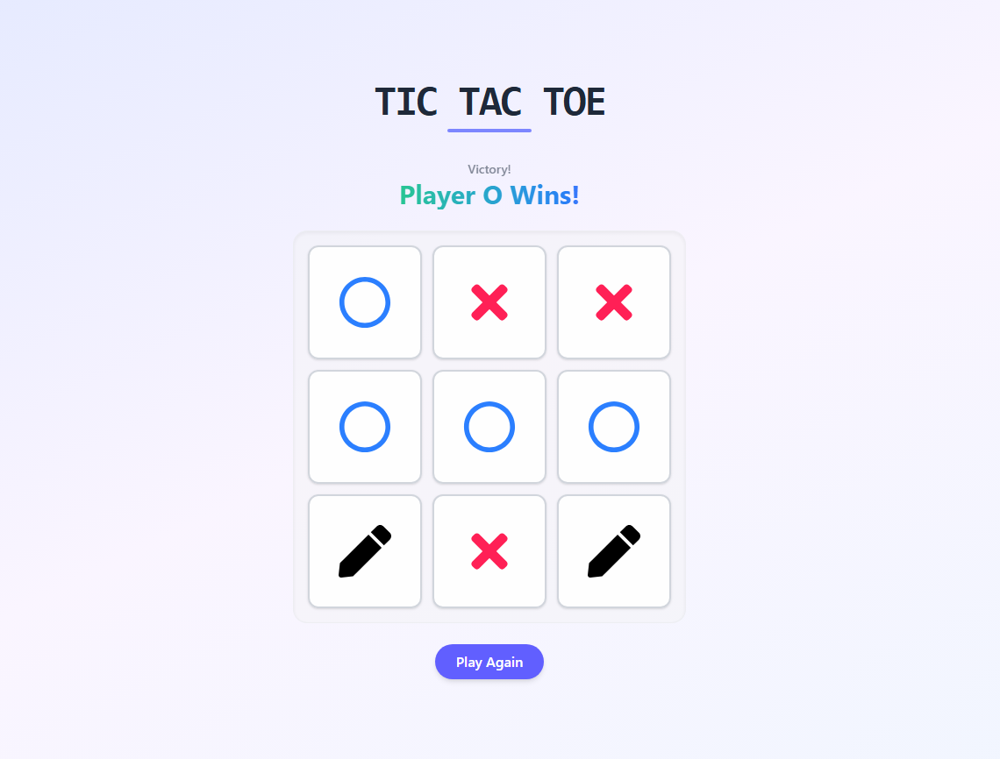

# TicTacToe-Game

A modern Tic Tac Toe game built with React and styled with Tailwind CSS, featuring smooth animations and game state management.

## Live Demo

You can play the game online [here](#).

## How to Play

1. The game begins with **Player O's** turn
2. Click any empty cell to place your mark
3. Players alternate turns automatically
4. First to get 3 matching symbols in a row wins
5. When all cells are filled without a winner, the game declares a draw
6. Click "Play Again" to restart the game

## Features

- **Beautiful UI**: Clean design with Tailwind CSS styling
- **Turn Indicator**: Shows whose turn it is (X/O)
- **Win Detection**: Instantly recognizes winning patterns
- **Draw Detection**: Automatically identifies tied games
- **Responsive**: Works on mobile and desktop
- **Animations**: Smooth hover effects and winning animations

Enjoy the game! ❌ ⭕🎮
